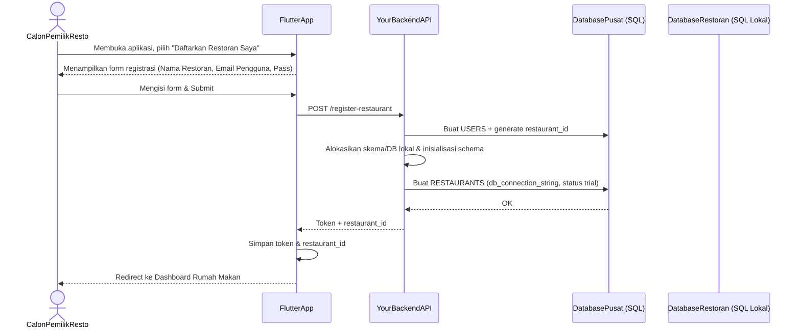
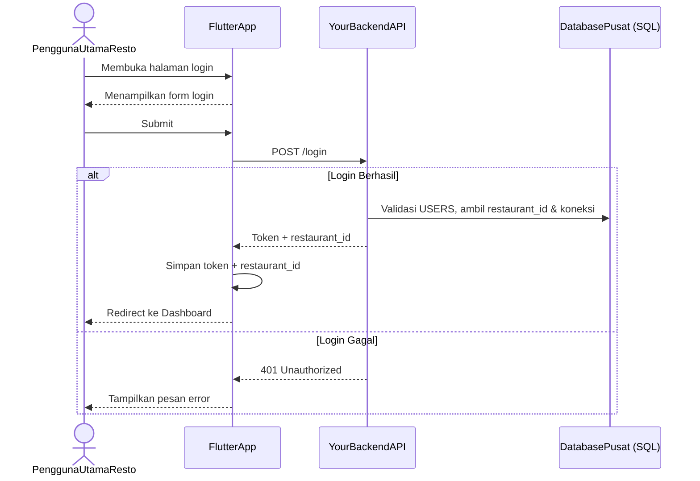

## Software Requirements Specification (SRS) - Aplikasi SaaS Manajemen Rumah Makan (Flutter, SQL Lokal, Multi-Restoran/Single-User per Restoran) - MVP Ramping

- **Versi**: 10.1 
- **Tanggal**: 28 Mei 2025
- **Penyusun**: Muhamad Azkal Fahmi Yahya_221240001336 dan Khaf Sari Inayati_221240001228

### 1. Pendahuluan
#### 1.1 Tujuan Proyek
Dokumen ini mendefinisikan kebutuhan untuk Minimum Viable Product (MVP) dari aplikasi Software as a Service (SaaS) manajemen rumah makan. Tujuan utama MVP adalah untuk menyediakan platform yang dapat digunakan oleh berbagai rumah makan (sebagai pelanggan/bisnis terpisah) untuk mengelola menu, inventaris bahan baku dasar, operasional kasir (POS), dan mendapatkan laporan penjualan dasar. Setiap rumah makan akan diwakili oleh satu akun pengguna utama. Aplikasi akan dikembangkan menggunakan Flutter untuk frontend dan backend kustom (menggunakan bahasa seperti Node.js/Python/Go/Java dengan database SQL) sebagai backend, dengan arsitektur multi-restoran di mana setiap rumah makan memiliki data yang terisolasi dalam database SQL lokal terpisah (atau skema terpisah dalam satu database SQL) di server SaaS yang Anda kelola. Aplikasi ini akan didistribusikan melalui Play Store dengan model berlangganan.

#### 1.2 Lingkup MVP
MVP akan fokus pada 6 alur kerja inti berikut untuk setiap rumah makan pelanggan:
- Registrasi Rumah Makan & Manajemen Akun Pengguna Utama.
- Manajemen Menu & Kategori.
- Point of Sales (POS) / Kasir (dengan pembayaran tunai dan struk sederhana).
- Manajemen Inventaris Bahan Baku (pencatatan, penambahan manual, pengurangan otomatis dari resep).
- Manajemen Resep (menghubungkan menu dengan bahan baku).
- Laporan Dasar Penjualan (misalnya, total penjualan harian/periodik, item terlaris).

Fitur yang TIDAK termasuk dalam MVP ini:
- Manajemen Meja (status meja, pemesanan per meja, tata letak meja).
- Akuntansi Dasar yang Detail (pembuatan jurnal akuntansi otomatis yang lengkap seperti debit/kredit spesifik, Laporan Laba Rugi formal, Neraca). Perhitungan Harga Pokok Penjualan (COGS) akan terjadi secara implisit melalui pengurangan stok bahan baku berdasarkan resep, namun tidak ada penjurnalan akuntansi formal atau Laporan Laba Rugi yang dihasilkan sistem di MVP ini.
- Manajemen Langganan Otomatis oleh Super Admin SaaS (proses billing dan aktivasi langganan akan dilakukan secara manual/eksternal untuk MVP).
- Manajemen multi-user internal dalam satu rumah makan (misalnya, Admin membuat akun Kasir/Pelayan terpisah dengan login sendiri).
- Metode pembayaran selain tunai di POS (misalnya, kartu kredit/debit, e-wallet).
- Fitur diskon kompleks, promosi, atau voucher per rumah makan.
- Integrasi dengan pihak ketiga (seperti payment gateway, aplikasi pesan antar online).
- Fungsionalitas offline POS yang canggih (selain kemampuan dasar karena data inti ada di backend; MVP akan memerlukan koneksi untuk operasi CRUD).
- Backup & Restore data oleh pengguna (baik lokal maupun online). Ini adalah fitur penting, namun untuk MVP yang sangat ramping, akan ditunda ke iterasi berikutnya setelah validasi pasar.
- Kustomisasi template struk yang mendalam.

### 1.3 Pengguna Target & Peran
Arsitektur menggunakan satu database pusat (misalnya PostgreSQL/MySQL) untuk data SaaS, dengan database SQL lokal terpisah (atau skema terpisah dalam database pusat) untuk setiap Rumah Makan Pelanggan.
- Pengguna Utama Rumah Makan: Mendaftar, mengelola menu, inventaris, transaksi POS, dan melihat laporan.
- Super Admin SaaS: Mengelola platform, akses database pusat, memantau dan mengubah status langganan secara manual.

### 1.4 Definisi & Akronim
- SaaS, MVP, POS, COGS, Flutter, SQL Lokal, restaurant_id, db_connection_string.

### 2. Kebutuhan Fungsional
2.1 Manajemen Registrasi Rumah Makan & Akun Pengguna Utama (Multi-Restoran via SQL Lokal)
REG-001: Sistem harus memungkinkan calon pemilik/manajer rumah makan untuk mendaftarkan rumah makannya dengan membuat satu akun pengguna utama.
Detail: Membutuhkan nama rumah makan, email pengguna utama, password. Saat pendaftaran berhasil, sistem backend Anda secara otomatis:
Mencatat pengguna utama di tabel USERS di database pusat.
Membuat atau mengalokasikan skema/database SQL lokal baru (misal, db_<restaurant_id>) di server database Anda untuk rumah makan ini.
Menginisialisasi skema tabel (seperti menu_items, ingredients, sales_transactions, dll.) di database SQL lokal baru tersebut.
Menyimpan restaurant_id dan db_connection_string (atau ID yang menunjuk ke sana) di tabel RESTAURANTS di database pusat, dan juga mengaitkannya dengan pengguna di tabel USERS.
Membuat entri di tabel RESTAURANTS (database pusat) yang mencatat informasi rumah makan baru dan status langganan default (misal, "trial").
Aktor: Calon Pemilik/Manajer Rumah Makan.
REG-002: Sistem harus menyediakan mekanisme login untuk pengguna utama rumah makan yang sudah terdaftar.
Detail: Setelah login berhasil, aplikasi Flutter memanggil API backend. Backend memvalidasi kredensial di tabel USERS (database pusat), mengambil restaurant_id dan db_connection_string yang terkait dari tabel RESTAURANTS, dan menggunakannya untuk mengarahkan semua operasi CRUD data ke database SQL lokal rumah makan yang benar. Token otentikasi akan dikembalikan ke aplikasi Flutter.
Aktor: Pengguna Utama Rumah Makan.
PROFILE-RESTO-001: Pengguna Utama Rumah Makan dapat mengedit informasi dasar rumah makannya (Nama Rumah Makan, Alamat, Kontak) yang disimpan di tabel RESTAURANTS (database pusat) melalui API backend.
Aktor: Pengguna Utama Rumah Makan.
SUB-001 (Disederhanakan untuk MVP): Super Admin SaaS dapat melihat daftar rumah makan pelanggan dan status langganan mereka melalui antarmuka admin sederhana atau langsung dari tabel RESTAURANTS di database pusat, dan dapat mengubah status langganan secara manual.
Aktor: Super Admin SaaS.
2.2 Manajemen Menu & Kategori (Per Rumah Makan, Data di Database SQL Lokal)
MENU-001: Pengguna Utama Rumah Makan dapat menambahkan, mengedit, dan menghapus kategori menu untuk rumah makannya. Data disimpan di tabel MENU_CATEGORIES di database SQL lokal mereka melalui API backend.
Aktor: Pengguna Utama Rumah Makan.
MENU-002: Pengguna Utama Rumah Makan dapat menambahkan, mengedit, dan menghapus item menu untuk rumah makannya. Data disimpan di tabel MENU_ITEMS di database SQL lokal mereka melalui API backend.
Input: Nama Menu, Deskripsi (opsional), Harga Jual, Kategori, Foto (opsional, disimpan di sistem penyimpanan server yang terkait dan URL-nya di database SQL lokal).
Aktor: Pengguna Utama Rumah Makan.
MENU-003: Pengguna Utama Rumah Makan dapat melihat daftar menu yang tersedia dari tabel MENU_ITEMS di database SQL lokal rumah makan mereka saat melakukan operasi POS atau manajemen melalui API backend.
Aktor: Pengguna Utama Rumah Makan.
2.3 Manajemen Resep (Per Rumah Makan, Data di Database SQL Lokal)
RECIPE-001: Pengguna Utama Rumah Makan dapat membuat dan mengelola resep untuk setiap item menu di rumah makannya. Data disimpan di tabel RECIPE_DETAILS di database SQL lokal mereka melalui API backend.
Detail: Satu item menu dapat terdiri dari beberapa bahan baku dengan kuantitas tertentu.
Input: Pilih Item Menu, Pilih Bahan Baku, Masukkan Kuantitas Bahan Baku yang Dibutuhkan per porsi.
Aktor: Pengguna Utama Rumah Makan.
2.4 Manajemen Inventaris Bahan Baku (Per Rumah Makan, Data di Database SQL Lokal)
INV-001: Pengguna Utama Rumah Makan dapat menambahkan, mengedit, dan menghapus bahan baku untuk rumah makannya. Data disimpan di tabel INGREDIENTS di database SQL lokal mereka melalui API backend.
Input: Nama Bahan Baku, SKU (opsional), Satuan Ukur, Harga Beli/Modal per satuan, Stok Awal.
Aktor: Pengguna Utama Rumah Makan.
INV-002: Pengguna Utama Rumah Makan dapat melihat daftar semua bahan baku beserta sisa stok dan nilainya dari tabel INGREDIENTS di database SQL lokal rumah makan mereka melalui API backend.
Aktor: Pengguna Utama Rumah Makan.
INV-003: Sistem backend harus secara otomatis mengurangi kuantitas stok bahan baku yang relevan (di tabel INGREDIENTS di database SQL lokal) berdasarkan resep menu yang terjual di rumah makan tersebut.
Pemicu: Penyelesaian transaksi penjualan melalui API backend.
INV-004: Pengguna Utama Rumah Makan dapat melakukan penyesuaian stok manual bahan baku di rumah makannya. Data disimpan di tabel INGREDIENTS di database SQL lokal mereka melalui API backend.
Aktor: Pengguna Utama Rumah Makan.
INV-005: Sistem harus menyediakan laporan dasar stok bahan baku (sisa stok) dari tabel INGREDIENTS di database SQL lokal rumah makan mereka melalui API backend.
Aktor: Pengguna Utama Rumah Makan.
2.5 Modul Point of Sales (POS) / Kasir (Per Rumah Makan, Data di Database SQL Lokal)
POS-001: Pengguna Utama Rumah Makan dapat memulai sesi penjualan/transaksi baru (fokus pada take-away/transaksi langsung untuk MVP).
Aktor: Pengguna Utama Rumah Makan.
POS-002: Pengguna Utama Rumah Makan dapat memilih item menu dari daftar (dari tabel MENU_ITEMS di database SQL lokalnya) untuk ditambahkan ke transaksi.
Aktor: Pengguna Utama Rumah Makan.
POS-003: Sistem harus menampilkan daftar item yang dipilih, kuantitas, harga satuan, dan subtotal per item dalam transaksi berjalan.
Aktor: Pengguna Utama Rumah Makan.
POS-004: Pengguna Utama Rumah Makan dapat mengubah kuantitas item atau menghapus item dari transaksi berjalan.
Aktor: Pengguna Utama Rumah Makan.
POS-005: Sistem harus menghitung total transaksi secara otomatis.
Aktor: Pengguna Utama Rumah Makan.
POS-006: Pengguna Utama Rumah Makan dapat memasukkan jumlah uang tunai yang diterima dari pelanggan.
Aktor: Pengguna Utama Rumah Makan.
POS-007: Sistem harus menghitung dan menampilkan jumlah kembalian.
Aktor: Pengguna Utama Rumah Makan.
POS-008: Setelah pembayaran, sistem backend harus menyimpan detail transaksi penjualan ke tabel SALES_TRANSACTIONS dan SALES_TRANSACTION_DETAILS di database SQL lokal yang bersangkutan.
Pemicu: Penyelesaian transaksi. Ini juga akan memicu INV-003 (pengurangan stok).
Aktor: Sistem.
POS-009: Sistem harus dapat mencetak struk penjualan sederhana (nama rumah makan dari info terdaftar, tanggal/waktu, item, harga, total, bayar, kembalian).
Aktor: Pengguna Utama Rumah Makan.
POS-010: Pengguna Utama Rumah Makan dapat melihat riwayat transaksi penjualan (daftar transaksi dengan total) dari tabel SALES_TRANSACTIONS di database SQL lokalnya melalui API backend.
Aktor: Pengguna Utama Rumah Makan.
2.6 Laporan Dasar Penjualan (Per Rumah Makan, Data dari Database SQL Lokal)
REPORT-001: Pengguna Utama Rumah Makan dapat melihat laporan total penjualan berdasarkan periode yang dipilih (misalnya, harian, mingguan, bulanan).
Isi Minimal: Jumlah transaksi, total pendapatan kotor.
Aktor: Pengguna Utama Rumah Makan.
REPORT-002: Pengguna Utama Rumah Makan dapat melihat laporan item menu terlaris berdasarkan periode yang dipilih.
Isi Minimal: Daftar item menu diurutkan berdasarkan kuantitas terjual atau total pendapatan per item.
Aktor: Pengguna Utama Rumah Makan.
3. Kebutuhan Non-Fungsional
3.1 Multi-Restoran & Isolasi Data
NFR-MR-001: Aplikasi menggunakan satu backend SaaS pusat. Setiap Rumah Makan Pelanggan harus memiliki database SQL lokal yang terisolasi (atau skema terpisah dalam satu database SQL) di server backend Anda.
NFR-MR-002: Data operasional satu rumah makan (menu, penjualan, inventaris) harus sepenuhnya terisolasi dan tidak dapat diakses oleh rumah makan lain. Ini dijamin melalui arsitektur database SQL terpisah dan kontrol akses di lapisan backend API.
NFR-MR-003: Aplikasi Flutter harus berkomunikasi dengan API backend pusat. Backend akan mengidentifikasi db_connection_string rumah makan dari pengguna yang login dan mengarahkan semua permintaan CRUD data operasional ke database SQL lokal rumah makan yang sesuai.
3.2 Keamanan
NFR-SEC-001: Proses registrasi dan login pengguna ke platform menggunakan mekanisme otentikasi yang aman di backend SaaS pusat (misalnya, hashing password, JWT/OAuth untuk sesi).
NFR-SEC-002: Akses ke data di dalam database SQL lokal dikontrol ketat oleh lapisan API backend. Aplikasi Flutter tidak boleh memiliki akses langsung ke database SQL lokal.
NFR-SEC-003: Aplikasi Flutter harus menangani session token dengan aman.
NFR-SEC-004: Backend harus menerapkan validasi input yang kuat untuk mencegah SQL Injection dan serangan lainnya.
3.3 Usability (Kemudahan Penggunaan)
NFR-USB-001: Antarmuka pengguna Flutter harus bersih, intuitif, dan mudah digunakan di perangkat mobile, terutama oleh pemilik/manajer rumah makan yang mungkin tidak terlalu teknis.
NFR-USB-002: Proses pendaftaran rumah makan baru harus sederhana dan cepat.
NFR-USB-003: Alur kerja utama (POS, input menu, input inventaris) harus efisien.
3.4 Performa
NFR-PRF-001: Aplikasi harus responsif terhadap input pengguna.
NFR-PRF-002: Query ke database SQL lokal tenant melalui API backend harus dioptimalkan untuk kecepatan, terutama untuk daftar menu dan transaksi. Backend harus memiliki waktu respons API yang rendah.
3.5 Ketersediaan & Keandalan (Backend & Database SQL)
NFR-AVR-001: Platform SaaS (backend dan database SQL yang Anda kelola) harus memiliki ketersediaan tinggi untuk memastikan pengguna dapat mengakses layanan.
NFR-AVR-002: Data setiap rumah makan di database SQL lokal mereka harus di-backup secara reguler melalui mekanisme manajemen database yang Anda konfigurasi.
3.6 Skalabilitas (Backend & Database SQL)
NFR-SCL-001: Arsitektur backend dan database SQL (dengan banyak database/skema pelanggan) harus dirancang untuk dapat menangani pertumbuhan jumlah rumah makan pelanggan dan volume data mereka. Perlu pertimbangan pada desain database (indeks, normalisasi), optimasi query, dan kapasitas server.
NFR-SCL-002: Backend API harus dapat menangani peningkatan jumlah permintaan dari berbagai pelanggan secara bersamaan.
3.7 Distribusi & Monetisasi
NFR-DIST-001: Aplikasi Flutter akan didistribusikan melalui Google Play Store.
NFR-MON-001: Model monetisasi adalah berlangganan (misalnya, bulanan atau tahunan). Untuk MVP, proses penagihan dan aktivasi langganan akan dilakukan secara manual/eksternal oleh Super Admin SaaS, dengan status langganan (subscription_status) dicatat di tabel RESTAURANTS di database pusat.
4. Model Data Awal (Sesuai ERD yang Dibuat)
4.1 Data di Database Pusat (Backend SaaS)
Tabel: USERS
id (PK)
email (UNIQUE)
password_hash
name
is_super_admin
created_at, updated_at
Tabel: RESTAURANTS
id (PK)
restaurant_name
primary_user_id (FK ke USERS.id)
db_connection_string (UNIQUE, atau identifier untuk database/skema SQL lokal)
subscription_status
trial_ends_at
subscription_ends_at
address
phone
currency_symbol
created_at, updated_at
4.2 Data di Dalam Setiap Database SQL Lokal Rumah Makan
Tabel: MENU_CATEGORIES
id (PK)
name (UNIQUE)
description
created_at, updated_at
Tabel: MENU_ITEMS
id (PK)
name (UNIQUE)
description
price
category_id (FK ke MENU_CATEGORIES.id)
image_url
is_available
created_at, updated_at
Tabel: INGREDIENTS (Bahan Baku):
id (PK)
name (UNIQUE)
sku (UNIQUE)
unit_of_measure
purchase_price_per_unit
current_stock
created_at, updated_at
Tabel: RECIPE_DETAILS (Resep):
id (PK)
menu_item_id (FK ke MENU_ITEMS.id)
ingredient_id (FK ke INGREDIENTS.id)
quantity_needed
created_at, updated_at
Tabel: SALES_TRANSACTIONS:
id (PK)
transaction_date
total_amount_paid
cash_received
change_amount
processed_by_user_id (ID user dari database pusat yang melakukan transaksi)
created_at, updated_at
Tabel: SALES_TRANSACTION_DETAILS:
id (PK)
transaction_id (FK ke SALES_TRANSACTIONS.id)
menu_item_id (FK ke MENU_ITEMS.id)
menu_item_name_at_sale
quantity_sold
price_at_sale
cost_price_total_for_items
subtotal_revenue
created_at, updated_at
5. Alur Pengguna Utama
Alur pengguna ini akan direalisasikan melalui interaksi aplikasi Flutter dengan API backend Anda, yang kemudian akan berinteraksi dengan database SQL yang sesuai.

#### 5.1 Alur Registrasi Rumah Makan Baru & Login Pengguna Utama Rumah Makan




```mermaid
graph TD
    A[Pengguna Utama Login & Akses POS] --> B[Pilih Kategori Menu (DB Restoran)]
    B --> C[Pilih Item Menu (DB Restoran)]
    C --> D{Tambah ke Transaksi}
    D -- Ya --> E[Item ditambahkan ke daftar transaksi]
    E --> F{Ada Item Lain?}
    F -- Ya --> B
    F -- Tidak --> G[Konfirmasi Transaksi & Hitung Total]
    G --> H[Proses Pembayaran (Input Tunai)]
    H --> I[Sistem Hitung Kembalian]
    I --> J[Selesaikan Transaksi & Kirim ke Backend API]
    J --> K[Simpan ke sales_transactions & sales_transaction_details]
    K --> L[Update stok bahan baku dari resep]
    L --> M[Cetak Struk]
    M --> N[Transaksi Selesai]
```